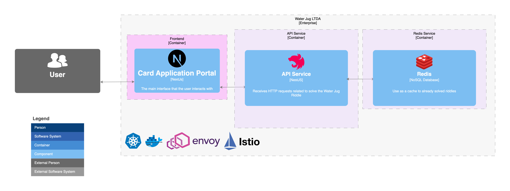

# Water Jug Riddle

This project provides a solution to the famous Water Jug Riddle, implemented in TypeScript.

## TL;DR

You can run a simple version of the entire system using Docker Compose. To do this just run:

```bash
docker compose up --build
```

It will build both the frontend and the backend, and also the Redis structure. After that, you can
access the UI at [http://localhost:3000](http://localhost:3000).

Remember to create the network:

```bash
docker network create app_network
```

## Quick Start

1. Clone the repository

    ```bash
    git clone https://github.com/palerique/wwaterjugriddle.git
    ```

2. Navigate into the cloned repository

    ```bash
    cd wwaterjugriddle
    ```

3. Install the dependencies

    ```bash
    pnpm install
    ```

### Docker Setup

For docker setup, a network named `app_network` is used. Here are the steps to setup it.

1. Create docker network by running

    ```bash
    docker network create app_network
    ```

2. To build and run the application in Docker environment, execute:

    ```bash
    docker compose up --build
    ```

3. If you want to run just the Redis structure, without the application, so you can run it
   using `pnpm`, use this command:

    ```bash
    docker compose up redis redis-commander
    ```

If you get an error about the `app_network` not being found, please make sure you have created it as
given in first step.

## Run Locally for development

After completing the Quick start and the Docker Setup steps:

1. Run the application in development mode

    ```bash
    pnpm dev
    ```

This will bring up the frontend and the backend. You need to have Redis running. Check the steps
above to know how to run Redis.

## Run locally with multiple instances, auto-scaling, load balancing, service mesh:

I have prepared a bunch of bash scripts to automate the process of running the application in a
kubernetes cluster.

For this to work you need to have a kubernetes cluster running.
I have tested this on a local kubernetes cluster using Docker Desktop.
Also, you need to have `kubectl` and `helm` installed.

1. Run the following command to deploy the application in a kubernetes cluster:

    ```bash
    ./build-and-run-k8s.sh
    ```

## Load Testing Video

A detailed load testing for this application is available in
this [video](https://drive.google.com/file/d/1-RZrsHB6PxSfCfnlqMDSXAqisCgCk8P2/view?usp=sharing).

Note: If you encounter any issues while setting up or running the project, feel free to reach out to
us through the issues section on this repository. The main intention of this ReadMe is to guide
every user properly on how to run this project.

# Water Jug Riddle System Components

## System Overview

This system consists of multiple components deployed on a Kubernetes cluster, including an API
server, a web server, and monitoring tools such as Prometheus, Grafana, and Kiali. The following
table provides detailed information about each component.

| Component  | Address                                        | Description                                                     |
|------------|------------------------------------------------|-----------------------------------------------------------------|
| API Server | [http://localhost:3002](http://localhost:3002) | Provides the backend logic for the Water Jug Riddle application |
| Web Server | [http://localhost:3000](http://localhost:3000) | Serves the frontend of the Water Jug Riddle application         |
| Prometheus | [http://localhost:9090](http://localhost:9090) | Collects metrics from the Kubernetes cluster and applications   |
| Grafana    | [http://localhost:8180](http://localhost:8180) | Visualizes metrics collected by Prometheus                      |
| Kiali      | [http://localhost:8380](http://localhost:8380) | Observes and manages the Istio service mesh                     |
| Redis      | localhost:6379                                 | In-memory data structure store, used as a database and cache    |

## Detailed Component Description

### API Server

- **Address:** [http://localhost:3002](http://localhost:3002)
- **Description:** The API server handles the backend logic for the Water Jug Riddle application,
  processing requests and interacting with the Redis database.

### Web Server

- **Address:** [http://localhost:3000](http://localhost:3000)
- **Description:** The web server provides the frontend interface for users to interact with the
  Water Jug Riddle application.

### Prometheus

- **Address:** [http://localhost:9090](http://localhost:9090)
- **Description:** Prometheus collects and stores metrics from the Kubernetes cluster and the
  applications running within it. It is used for monitoring and alerting.

### Grafana

- **Address:** [http://localhost:8180](http://localhost:8180)
- **Description:** Grafana is a visualization tool that creates dashboards and graphs from the
  metrics collected by Prometheus. It helps in monitoring the health and performance of the system.

### Kiali

- **Address:** [http://localhost:8380](http://localhost:8380)
- **Description:** Kiali provides observability into the Istio service mesh. It helps in managing
  traffic, visualizing service dependencies, and troubleshooting issues.

### Redis

- **Address:** localhost:6379
- **Description:** Redis is an in-memory data structure store, used as a database and cache for the
  application. It stores temporary data and speeds up data retrieval.

## System Diagram

The following diagram illustrates the architecture of the Water Jug Riddle system, showing how the
various components interact with each other:



# Algorithm

This project uses the Breadth First Search (BFS) algorithm to solve the Water Jug Riddle. Here's a
brief description of the BFS and why it's advantageous over the Depth First Search (DFS) algorithm.

Breadth First Search (BFS) is an algorithm for traversing or searching tree or graph data
structures. It starts at the tree root or at some arbitrary node of a graph, and explores all of the
neighbor nodes at the present depth prior to moving on to nodes at the next depth level.

/* Disadvantages of DFS and why BFS is better */
Depth First Search (DFS) is an algorithm for traversing or searching tree or graph data structures.
The algorithm starts at the root and explores as far as possible along each branch before
backtracking. However, in scenarios like the Water Jug Riddle where we need to find the optimal
solution, DFS can lead to suboptimal results as it may not provide the shortest path to the
solution.

**BFS Animated Example**


[BFS explanation and animation source](https://commons.wikimedia.org/wiki/File:Breadth-First-Search-Algorithm.gif)

**DFS Animated Example**


[DFS explanation and animation source](https://commons.wikimedia.org/wiki/File:Depth-First-Search.gif)
